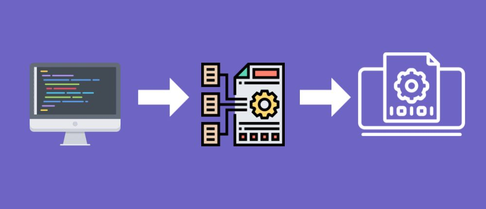


# Interpreter for LISP-Like language 
This project was the grand finale of our `Information and Computation course`. Our main objectives were to get hands-on experience with C++ syntax and deepen our grasp of object-oriented programming.  

Along the way, we also had the chance to explore UML (Unified Modeling Language) and different design patterns, making our journey through software development.  

If you find this repository useful, please consider giving it a ⭐ star. Your support is greatly appreciated!
## Table of Contents

- [About](#about)
- [Getting Started](#getting_started)
- [Installing](#installing)
- [Usage](#usage)

## About
1.  __Lexer/Tokenizer:__
- `Purpose`: The lexer, also known as a tokenizer, is the initial stage of interpreting code. It breaks down the source code into small, meaningful units called tokens. Tokens represent the fundamental building blocks of a programming language, including keywords, operators, variables, and literals.  

- `Function`: The lexer scans the source code character by character, identifying and categorizing each character or group of characters into tokens. It strips away extraneous information like whitespace and comments, producing a stream of tokens that serve as input for the parser.  


2. __Parser:__
- `Purpose`: The parser takes the stream of tokens produced by the lexer and constructs a hierarchical representation of the code, often in the form of a syntax tree or abstract syntax tree (AST). The parser's primary role is to enforce the syntax and grammar rules of the programming language.  

- `Function`: The parser reads the tokens and organizes them into a structured tree-like data structure that reflects the code's syntactic structure. It checks for correct ordering of language elements, matches opening and closing brackets, and ensures the code adheres to the defined grammar rules. This syntax tree or AST becomes the foundation for further stages of interpretation.

3. __Semantic Analysis:__
- `Purpose`: Semantic analysis goes beyond syntax to check the meaning and correctness of the code. It enforces semantic rules, such as variable type compatibility, scope resolution, and adherence to language-specific constraints.  

- `Function`: The semantic analysis phase ensures that variables are declared before use, types are consistent, and function calls are valid. It helps identify and prevent common programming errors, ensuring that the code is semantically correct. If any semantic errors are found, the interpreter may issue error messages to guide the user in fixing the issues.
## Installing
To install the Lisp-like language interpreter, follow these steps:  
1. Download the Source Code.
2. Compile the Main File:  	
	Using a C++ compiler like `g++`, navigate to the directory where you've stored the source code. Run the following command to compile the main file, named *LispInterpreter.cpp*:

```
g++ LispInterpreter.cpp -o LispInterpreter
```

This command will compile the code and generate an executable named *LispInterpreter*.  

 3. Run the Interpreter:  
you can execute the interpreter by running and you should pass the input (txt) file as the first argument like: 
```console
./LispInterpreter FAIL_DivisionByZero.txt
```
You can find alot input file in the file 'LispInterpreter_TestFiles.zip'.
## Usage
The project serves as an invaluable resource for students and educators in computer science and programming-related disciplines. It can be employed for learning and teaching purposes, helping students grasp the intricate concepts of programming language design and interpretation.
